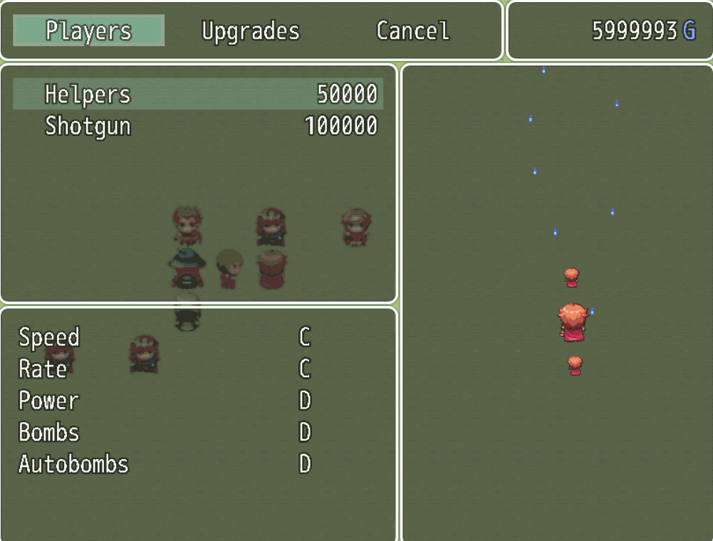

Bullet Hell Plugin for RPG Maker MV
===================================

This JavaScript plugin for [RPG Maker MV](http://www.rpgmakerweb.com/products/programs/rpg-maker-mv) implements a Bullet Hell minigame leveraging the Map Editor for easy design of stages.

Bullet Hell
-----------

A Bullet Hell (also known as Danmaku or Manic Shooter) is a shoot 'em up subgenre characterised by a huge quantity of bullets on screen.
Other features of the subgenre tend towards minimalism (for example most of the times the player doesn't have a health bar and will die on one hit, or if there are protective power ups, the player can't rely on them too much), making the games extremely reliant on player's skills in dodging enemy bullets.

To make games fair towards the player, bullets tend to be slower than traditional shoot 'em up and are almost never aimed directly at the player, instead they spread from the enemies in beautiful patterns which are easy to predict (but hard to dodge).
There is no *certain death* and the player can escape every dangerous situation (except those caused by their own lack of foreseeing), to make gameplay more forgiving, most games provide a *panic attack* feature, i.e. a mean to get away from danger (usually in the form of a shield or a bomb).

Plugin features
---------------

This plugin allows to create Bullet Hell stages with many different kinds of enemies, each with their own unique traits,  playable as minigames in an RPG Maker MV game.

The engine can be extended easily, allowing bosses design and customisation of every player's aspect. 

An in-game shop allows to buy new players (each with their own unique shooting patterns and bombing abilities) and upgrade them.

Gameplay
--------

Stages can be played with any of the following input devices:

- Mouse: `left` click shoots, `right` click throws a bomb, the player will follow the pointer (in an absolute fashion),
- Touchscreen: `single` tap shoots, `double` tap throws a bomb, `swipe` moves the player (in a relative fashion),
- Keyboard: `confirm` keys (`spacebar` or `enter`) shoot, `shift` key throws a bomb, `arrow` keys move the player,
- Gamepad: `confirm` keys shoot, `shift` key throws a bomb, `left analog stick` move the player (movement precision and gamepad's deadzone can be configured from the pause menu).

To open the pause menu you can:

- Press the `escape` key,
- Loose focus on the game window,
- Tap outside the game area.

Each stage scrolls vertically with enemies spawning in front of the player, a stage is cleared when there are no more enemies, or lost when the player looses their stock of lives.

The player can shoot from its main gun or drop a bomb, which causes all enemy bullets to explode while delivering heavy damage to enemies. The autobombing feature makes the player throw automatically a bomb when in a dangerous situation.

A ranking system allows to customise five parameters for each player:

- Speed,
- Fire rate,
- Fire power,
- Number of bombs,
- Autobombing effectiveness.

The shop allows to buy new players and upgrade them using the game's currency (new players and upgrades can be also given for free, for example as rewards from side quests or plot advancements).

Additional resources
--------------------

A demo can be downloaded in the [release section](https://github.com/HashakGik/BulletHell-RMMV/releases/latest), or can be played online [here](https://strontiumaluminate.altervista.org/bullethell).

A demonstration video is available on [YouTube](https://www.youtube.com/watch?v=D5rxpICS198).

A boss-rush gameplay, with more interesting patterns, can be seen [here](https://youtube.com/watch?v=hWj_7gTi194).

The internal JSDoc documentation is available [here](https://HashakGik.github.io/BulletHell-RMMV).

In-depth tutorials are available [here](https://HashakGik.github.io/BulletHell-RMMV/tutorial-getting_started.html).
